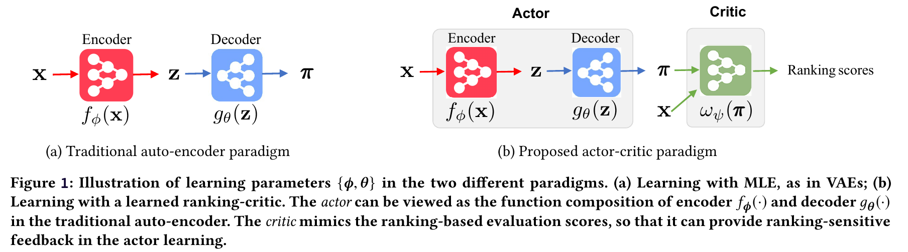

# Ranking-Critical Training for Collaborative Filtering

This repository implements [Ranking-Critical Training (RaCT) for Collaborative Filtering](https://arxiv.org/abs/1906.04281), accepted in _International Conference on Learning Representations (ICLR), 2020_.     


By using an actor-critic architecture to fine-tune a differentiable collaborative filtering model as shown in (b), we can improve the performance of a variety of MLE-based recommander functions, such as variational auto-encoders in (a).

  

The main result of this paper can be reproduced via running the `scripts/main_vae.py` file:

    cd scripts && python main_vae.py

## Running the code

1. Install the requirements in a **python3** environment

    `mkvirtualenv --python=python3 CRITIC_CF && pip install -r requirements.txt`

2. Install Tensorflow, version range >=1.10.0,<=1.14. 

3. Download the dataset you want to run with

    `python setup_data.py --dataset=DATASET_OF_CHOICE`

Default is *ml-20m*, which is the smallest dataset. Other options are `netflix-prize` (medium) and `msd` (largest). Or, run with `dataset=all` to download all.

4. **To train a model**, run one of the scripts in the `scripts` directory named `main_*.py` (see the `Main Scripts` section of the Readme). These scripts were used to generate the models and data in this paper. Or, create your own by modifying the hyperparameters or models used in one of these scripts.

5. The `train` method saves a model in a nested directory determined by its hyperparameters, within the `checkpoints` directory. It stores the data necessary for plotting in the `plotting_data` directory, and logs to the `logging` directory.
6. Passing these same hyperparameters to the `test` method as you did to `train` method will run the trained model against the held-out test data. After running `test`, results are written to the `TEST_RESULTS.txt` file, as well as to the console.

## Plots

All plots are generated from jupyter notebooks, located in the **paper_plots** directory. The data was loaded into the respective folders by copying files from the approproate `plotting_data` sub-directory. Enter the `paper_plots` directory in your terminal, and run `jupyter notebook`. A window should open in your web browser, where you can see/edit these scripts.

## Utils
The importable code used in the training scripts is located in the `./utils` directory.
* `warp_utils.py` contain the logic for implementing a listwise WARP-loss
* `lambdarank_utils.py` contains the logic for implementing LambdaRank
* `evaluation_functions.py` contains the logic for the ranking objective functions
* `base_models.py` and `models.py` contain the different models we train.
* `training.py` contains the `train` and `test` function used to run experiments.
* `data_loaders.py` implements importing the downloaded files as Tensorflow Datasets.

## Main Scripts

All of the scripts used to generate data are located in the `./scripts` directory.
* `main_vae.py`: **This provides the paper's main result, by running the MultiVAE model with and without the critic, on all datasets.** 
* `main_wmf.py` is used to generate results for the Weighted Matrix Factorization model on all 3 datasets.
* `main_mutlidae.py` is used to generate results for MutliDAE on ml-20m with and without the Critic (Table 4)
* `main_gaussian_vae.py` is used to generate results for Gaussian DAE on ml-20m with and without the Critic (Table 4)
* `main_warp.py` is used to generate results for WARP on ml-20m with and without the Critic (Table 4)
* `main_ablation.py` is used to generate results for the critic feature-ablation study.
* `main_change_cutoff.py` is used to generate results for comparing different critic cutoff-targets.
* `ncf_training.py` is used to generate results on the datasets we compare to Neural Collaborative Filtering (Table 3).
* `gather_data.py` is used to gather statistics from a fully trained model, for example figure 4/5.
* `setup_data.py` is used to download, extract, and process the data.


```
@inproceedings{Lobel_ract_2020_ICLR
  title={RaCT: Towards Amortized Ranking-Critical Training for Collaborative Filtering},
  author={Lobel, Sam and Li, Chunyuan and Gao, Jianfeng and Carin, Lawrence},
  booktitle={International Conference on Learning Representations},
  year={2020}
}
```

## Questions?
Please drop us ([Sam](https://github.com/samlobel) and [Chunyuan](http://chunyuan.li/)) a line if you have any questions.

